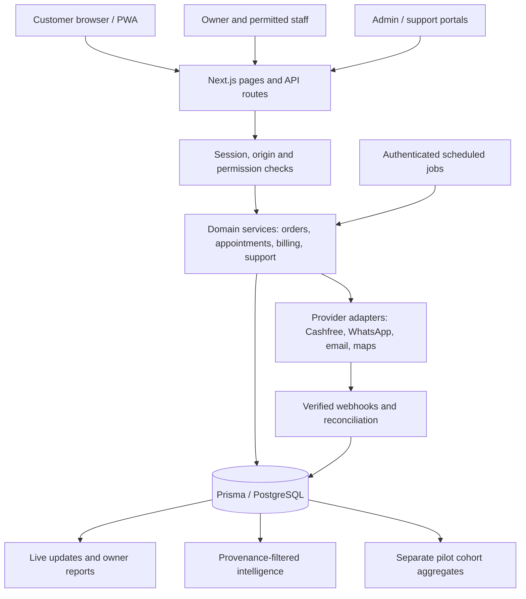

# VyapaarMate incubation readiness — 9 September 2026

**Assessment: a working local pilot demonstration, with material production and commercial evidence still outstanding.** The product must not be described as perfectly developed, fully validated AI, proven traction, or guaranteed investment/incubation.

This review used all 13 pages of `01_RTIH_VyapaarMate_Pitch_Deck.pdf`, all 3 rendered pages of `PSHR-INNOVEX-RTIH-Supporting-Brief.docx`, the two supplied logo images, current source code, an isolated local PostgreSQL database, and real browser logins. The source documents were treated as reference material. The founder's instruction establishes **Bengaluru and Andhra Pradesh as separate pilot cohorts**.

## What changed

- Applied the supplied black/green logo on light surfaces and white/green logo on dark surfaces. Added compact WebP assets, themed favicon, PWA and Apple icons, and social-sharing artwork. Source PNGs remain in `assets/brand`; `npm run brand:generate` regenerates web assets.
- Aligned registration, business setup, address validation, checkout, discovery, contact forms, metadata, chatbot copy and public pilot pages with the two-cohort plan. Bengaluru discounts remain location-specific. AP pins use coarse geographic bounds plus the stated city/state; KYC must verify the actual operating address.
- Added an administrator pilot report at `/admin/pilot`: explicit enrollment and consent confirmation, separate cohort metrics, two rolling weekly windows, recurring subscription value and aggregate JSON export. Demonstration/test records are excluded.
- Added business and subscription provenance, propagated it into new orders, payments, customers and catalog records, and corrected subscription metrics to exclude taxes, future periods, test data and duplicate current subscriptions per business.
- Fixed unsafe login return paths, malformed JSON handling in core write endpoints, nullable catalog durations, racing order-status changes, idempotent repeated completion and missing order completion timestamps.
- Added persistent, tenant-scoped campaign drafts with create, read, edit and delete operations. The interface explicitly states that campaign delivery is not enabled. Replaced false summary/reminder success messages with a real CSV download and a route to prepare a message.
- Blocked ordinary live-business dashboard deletion of order and customer financial history. Normal corrections use cancellation; data-removal requests use the existing account-data workflow. Disabled misleading delete controls in the connected dashboard.
- Neutralized formula-like text in CSV exports and removed an unused build-time Google font fetch. Added proper first-page headings to features, pricing and contact pages.

## Verification

The final evidence directory contains the browser route matrix, workflow checks and build/test logs. The browser uses local demo accounts through the actual sign-in forms, not fabricated sessions.

- **55 page routes, 165 viewport checks** at 1440, 390 and 320 pixels. Four portal login flows: business owner, customer, super administrator and support agent. Dynamic pages use known local store, order-token and subscription fixtures.
- **159 automated tests passed** across security, roles, payments, subscriptions, appointments, chatbot, business logic and intelligence logic.
- **113 local API/workflow checks passed**: order creation and authoritative prices, cash payment consistency, sequential and concurrent status transitions, receipts, assigned support access, cross-tenant and cross-role denial, malformed input, campaign persistence and protected-history deletion. Every discovered admin/dashboard/user route method received an unauthenticated denial probe; public support-chat routes received separate ownership checks.
- Pilot-report integration verified both cohorts, activation, weekly overlap, paid-subscription deduplication and money calculations; excluded test/cancelled/pre-enrollment/future/expired records. All synthetic LIVE-tagged calculation fixtures were removed afterward.
- Production build, ESLint, TypeScript and Prisma migration deployment passed locally. There are 53 migrations after these changes. Local PostgreSQL used compatibility roles and an `auth.uid()` stub to replay Supabase-oriented migrations; this is not hosted Supabase/RLS certification.

These checks do not exhaust every form state, browser/device, business category, provider callback, concurrency schedule or accessibility requirement. Desktop page captures and phone contact sheets were reviewed; important changed pages also have full-height captures. Appointment category logic has automated tests, but this food-business demo does not prove every appointment business workflow. No external campaign, email, SMS, WhatsApp message, payment or payout was sent.

## Documents and product alignment

| Source | Claim or intent | Implementation and disposition |
|---|---|---|
| Deck p1 | MSME operations software; founder/company | Consistent product identity. Company details are supplied, not independently certified. |
| Deck p2 | Fragmented orders and payment records | Unified customer/order/payment records exist. Time-saving remains an interview/pilot hypothesis. |
| Deck p3 | Workspace screenshot | Working owner portal checked locally. Historical/sample screen figures are not traction. |
| Deck p4 | Receive, track, retain customer, send permitted update | Local order-to-cash-to-completion flow verified. Actual provider delivery remains a release gate. |
| Deck p5 | Explainable rules/scoring; advanced AI needs evaluation | Public claims toned down. Unit tests verify logic, not prediction accuracy or merchant benefit. |
| Deck p6 | Four early decision-support modules | Existing rule/model code and UI reviewed; data quality, usefulness and model-performance evidence remain pilot work. |
| Deck p7 | Food businesses; Bengaluru and AP; owner pays | Two operating cohorts supported. Report each separately; choose comparable merchant segments. |
| Deck p8 | Monthly or annual subscriptions plus setup | Monthly checkout exists. Annual billing is proposed and must not be sold as available. Campaign sending is not enabled. Setup/service income stays separate. |
| Deck p9 | CIN, incorporation, next evidence is paid adoption | Provided records only. No new customer, revenue, DPIIT, funding or registration claim was invented. |
| Deck p10 | 20 interviews; 5 pilots; 90-day review | Targets retained as proposed totals across both cohorts, not 5 in each. Execution log required. |
| Deck p11 | Three-year staged expansion | Roadmap, not a committed outcome. Expansion depends on retention and delivery economics. |
| Deck p12 | Mentoring, introductions, workspace, funding guidance | Incubation request remains a request. No RTIH admission or investor interest implied. |
| Deck p13 | Founder contact and invitation to review | Retain founder-provided contacts; no outreach submitted. |
| Brief p1 | AP-only first segment; company/founder | Reconciled by founder decision: separate Bengaluru and AP cohorts; updated companion brief provided. |
| Brief p2 | Technology, demonstration and paused deployment | Architecture checked from source; local demonstration restored. Public deployment remains separate and was not changed. |
| Brief p3 | Cohort metrics, subscription income, mentoring plan | Pilot evidence dashboard added; interview, consent, support effort and paid-demand records must still be collected. |

## Architecture assessment

The current architecture is a reasonable **modular monolith for a small pilot**: Next.js/React views and route handlers, shared TypeScript business rules, Prisma/PostgreSQL, provider adapters and scheduled jobs. A microservice rewrite would add operating cost without evidence that this pilot needs it.

The server derives tenant identity from the session and scopes business queries; admin and support have distinct permissions. Payment status is separate from fulfillment status. PostgreSQL transactions protect cash updates and order transitions. Appointment code uses transactional scheduling safeguards. Provider adapters and job boundaries are present, but durable provider delivery, disaster recovery and deployed observability have not been demonstrated here.

The important remaining engineering work is operational: verify hosted database privileges and migration history; establish a restore drill and error/latency monitoring; verify provider webhook replay/refund reconciliation; define job retry ownership; and measure database query/stream behavior under expected load. Large existing components should be split by feature as they change, not through an unrelated rewrite. The campaign draft feature was extracted into its own component and API.

## Release gates and limitations

| Priority | Gate | Required evidence / owner |
|---|---|---|
| Before live onboarding | Deployment restored and reviewed | Founder/engineering: HTTPS deployed build, domain access, local fixes deployed, smoke tests on that exact deployment. Public URL previously returned HTTP 402. |
| Before live onboarding | Production environment check passes | Deployment operator: unique secrets, shared rate-limit storage, maps/places keys, explicit launch flags. Current local checkout's `production:check` fails; see evidence log. |
| Before live onboarding | Migration and tenant security verification | Engineering: backup, reviewed pending migrations, apply the correct chain to intended hosted project, protected endpoint tests and hosted database access checks. No remote migration was performed. |
| Before live payments | Payment lifecycle | Engineering/finance: configured provider sandbox and then approved live smoke, forged/replayed webhook rejection, reconciliation, refund/payout and accounting checks. Local cash proof is insufficient. |
| Before live messaging | Delivery and consent | Operations: approved templates, recipient consent, delivery failures/retries and status callbacks. Campaigns currently save drafts only. |
| Before live onboarding | Email and recovery | Operations: registration, verification, recovery and staff invite delivery on deployed domain. External email/SMS was disabled for this audit. |
| Before live data | Account retention and recovery | Founder/qualified reviewer: approve the existing versioned retention policy and exercise deletion/retention jobs and a database restore. Do not set the approval flag just to pass checks. |
| Before external traction claims | Provenance review | Founder: classify historical demo/test records; reconcile invoice receipts; obtain merchant consent; attach actual evidence. New migration only recognizes known built-in demo identifiers. |
| Before pricing expansion | Annual billing and campaigns | Product: annual terms/proration/renewal implementation and provider-backed campaign scheduling/delivery. Current availability must remain accurately stated. |
| Before scale claims | Load and security testing | Engineering: multi-tenant load, event-stream connection budget, dependency/security review, retention purge concurrency and incident response. Local checks are not an independent penetration test. |

The audit is scoped to the local website/PWA. Native app packaging, native icon refresh, physical-device QA, App Store/Play submission and production deployment were not completed by this work.

## Incubation and investment plan

Use a focused demonstration and a measurable validation request. Suggested wording: **“VyapaarMate has a working local operations workflow. We seek incubation support to validate repeat use and willingness to pay with separate Bengaluru and Andhra Pradesh food-business cohorts.”**

The official [RTIH overview](https://rtih.co.in/) describes support for startups and MSMEs, including innovation and entrepreneurship support. This is consistent with requesting merchant introductions and mentoring; it does not establish an invitation, admission, available funding amount or current selection outcome. Official site checked 9 September 2026.

1. **Days 1–30:** resolve launch gates, demonstrate one complete order workflow, conduct 20 documented owner interviews across the two cohorts. Record interview cohort, existing tools, weekly order volume, pain, current spend, and willingness-to-pay evidence. Choose an initial comparable segment.
2. **Days 31–60:** onboard 5 consenting merchants total. Log start time, setup completion, first real order, weekly activity, minutes of support, incidents, opt-in evidence and proposed price. Keep Bengaluru and AP recruitment and outcomes separate.
3. **Days 61–90:** review rolling-week repeat use and renewals alongside support cost and actual subscription collections. Record why inactive businesses stopped. Decide to improve, continue, or stop a segment based on evidence, not signup totals.

Maintain a simple pilot ledger with: merchant ID, cohort, segment, consent reference/date, interview date, enrollment date, setup minutes, first real transaction date, weekly activity, paid invoice reference, recurring price excluding GST, service/setup revenue, messaging/cloud cost, support minutes, cancellation reason and next decision. Store identifiable consent/interview records privately; share only approved aggregates.

**Funding preparation:** use a milestone budget, not an invented valuation or funding ask. List actual monthly founder/team cost, infrastructure, messaging, onboarding travel and support; show quoted sources and a modest contingency separately. Calculate monthly cash burn, available cash/runway and the amount required to reach the next independently reviewable pilot milestone. Keep merchant GMV, software subscription income and PSHR client-service income in separate schedules. Add incorporation documents, ownership/cap table, founder responsibilities, IP ownership, subscription receipts, pilot consent, retention definitions, customer findings and this technical evidence to the data room. None of those unprovided records are fabricated here.

## Local demonstration

Open `http://localhost:3000/login` and choose the matching portal query:

| Portal | URL suffix | Local-only email |
|---|---|---|
| Business owner | `/login?type=business` | `audit.owner@example.test` |
| Customer | `/login?type=user` | `audit.customer@example.test` |
| Administrator | `/login?type=admin` | `audit.admin@example.test` |
| Support agent | `/login?type=support` | `audit.support@example.test` |

Local fixture password: `AuditLocal123!`. AP owner: `audit.andhra.owner@example.test`, same password. All figures and accounts are synthetic. These credentials must never be deployed as live accounts.

The current isolated server launcher and database are in `/private/tmp/vyapaarmate-incubation-audit`; external provider credentials are blanked in its environment. Do not restart with ordinary `.env` and seed commands without checking the database host. Existing real `.env` files were not changed.

Reproducible checks are in `scripts/qa/portal-pages.mjs`, `portal-workflows.mjs`, `seed-pilot-cohorts.mjs` and `pilot-reporting-integration.ts`. Set `QA_OUTPUT_DIR` to a private directory; browser state files contain session cookies. Use an explicitly local database whose name contains `audit` or `test`, apply migrations, run the guarded existing responsive fixture seed followed by the cohort seed. The browser check accepts `PLAYWRIGHT_MODULE` and `CHROME_PATH`. Never publish browser state files.
